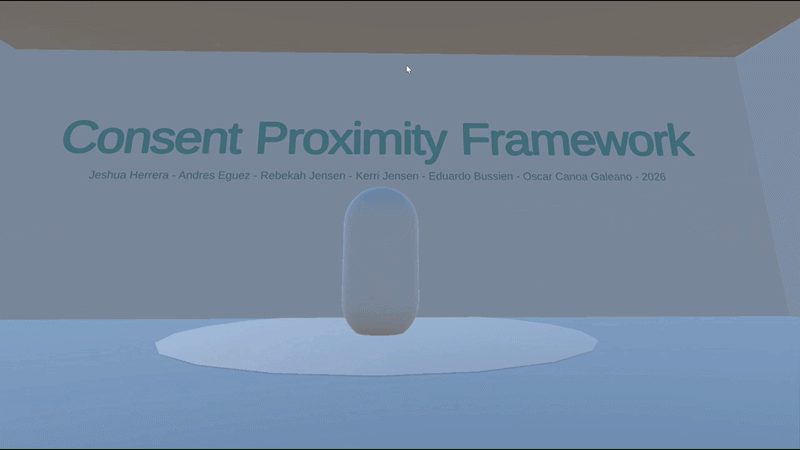
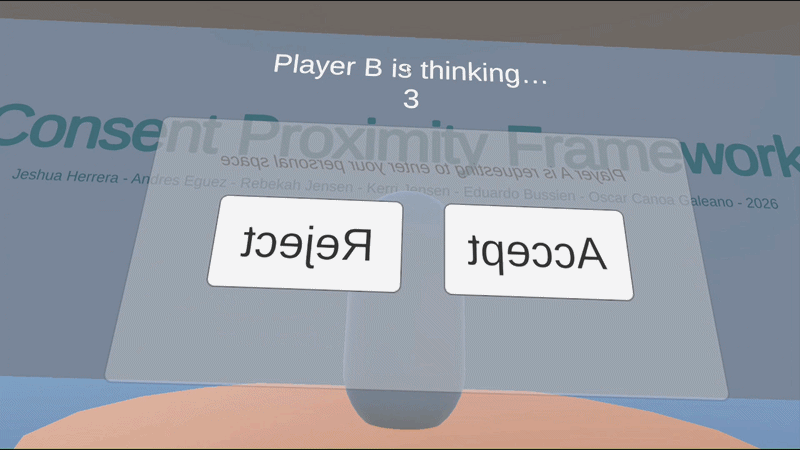
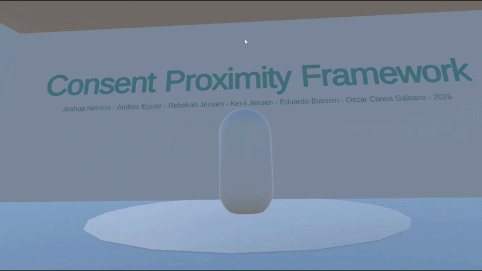
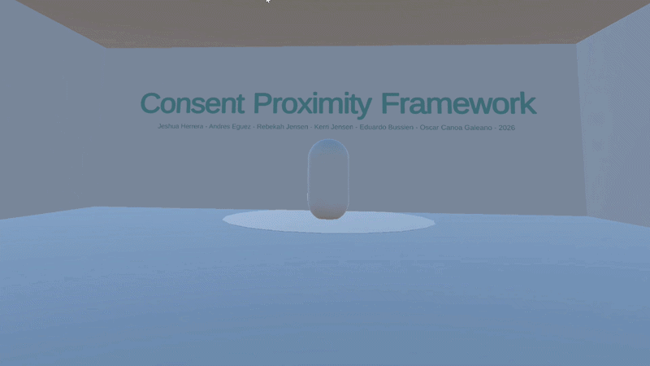

# Consent-Driven Proximity Interaction Framework

> A VR framework for **Meta Quest 3** that treats consent as a first-class mechanic in shared virtual spaces.  
> Players cannot enter another avatar's personal space without an explicit, mutual consent handshake — and either party can withdraw at any time.

Built with **Unity 6** (6000.3.6f1) · **OpenXR** · **Meta XR SDK v85** · **Netcode for GameObjects**

---

## Demo

| Consent Request | Accept Flow |
|---|---|
|  |  |
| **Reject Flow** | **Player B Idle** |
|  |  |

---

## What It Does

When Player A approaches Player B in VR, a consent request is automatically triggered. Player B must explicitly **Accept** before Player A can enter their personal space. Either party can **Withdraw** consent at any time. Rejections trigger a cooldown. The whole flow is enforced at the software level — not just a UI suggestion.

```
Player A approaches
        ↓
  [ Idle → InRange ]
        ↓
  [ InRange → Requested ]   ← consent popup appears
        ↓              ↓
   B Accepts        B Rejects
        ↓              ↓
  [ Active ]      [ Terminated ]
  free movement    cooldown + pushback
        ↓
  Either withdraws
        ↓
  [ Terminated ]
```

---

## Features

- 🎯 **Consent state machine** — `Idle → InRange → Requested → Active → Terminated` with full edge-case handling
- 🛡️ **Protected zone** — soft push-back enforced at the rig level when approaching without consent
- ⏱️ **Timeout handling** — auto-expires unanswered requests, triggers cooldown after rejection
- 🔄 **Session rules** — configurable one-consent-per-session and rejection cooldown timer
- 🎨 **Visual feedback** — green/red panel flash, floor consent ring, thinking countdown label
- 📋 **Live status board** — in-VR world-space display showing state, distance, cooldown, last decision
- 🎮 **Controller ray interaction** — wall-mounted Accept / Reject / Reset buttons
- 🌐 **Networking layer** — NGO-based `INetworkAdapter` for real multiplayer sync
- 📦 **Standalone APK** — runs natively on Quest 3, no PC tether required

---

## Team — JARKOE

| Name | Role | GitHub |
|---|---|---|
| **Jeshua Herrera** | Networking — Low-level NGO adapter, RPCs, NetworkVariables, authority rules | [@Jeshuah71](https://github.com/Jeshuah71) |
| **Andres Eguez** | Core Contracts + State Machine — interfaces, models, all state transitions and edge cases | [@Aeguez](https://github.com/Aeguez) |
| **Rebekah Jensen** | Proximity Detection — distance tracking, threshold events, hysteresis, update throttling | [@rebekahjensen](https://github.com/rebekahjensen) |
| **Kerri Jensen** | Consent UI + Input — consent prompt, accept/reject/withdraw, timeout, XR controller bindings | [@kerrijensen](https://github.com/kerrijensen) |
| **Oscar Canoa** | Feedback + Networking Flow — haptics, visual indicators, disconnect handling, race conditions | [@Oscaar-cg](https://github.com/Oscaar-cg) |
| **Edu Bussien** | Integrator + Test Harness — wired all modules together, integration tests, Quest 3 APK deploy | [@eduardobussien](https://github.com/eduardobussien) |

---

## Architecture

```
┌─────────────────────────────────────────────────────────┐
│                     TestHarness Scene                    │
│                   (HarnessController)                    │
│                                                          │
│  ┌──────────────┐    ┌──────────────┐    ┌───────────┐  │
│  │ Proximity    │    │   Consent    │    │  Consent  │  │
│  │ Service      │───▶│   State      │───▶│    UI     │  │
│  │ (Rebekah)    │    │   Machine    │    │  (Kerri)  │  │
│  └──────────────┘    │  (Andres)    │    └───────────┘  │
│                      └──────┬───────┘                   │
│  ┌──────────────┐           │         ┌───────────────┐ │
│  │  Networking  │           │         │   Feedback    │ │
│  │  Adapter     │◀──────────┘         │   Manager     │ │
│  │(Jeshua/Oscar)│                     │   (Oscar)     │ │
│  └──────────────┘                     └───────────────┘ │
└─────────────────────────────────────────────────────────┘
```

Each module is developed against a shared interface contract (`IConsentService`, `IProximityService`, `INetworkAdapter`). No module depends on another's implementation — only its interface.

---

## Project Structure

```
Assets/
├── ConsentProximityFramework/        # Core framework
│   ├── Runtime/
│   │   ├── ConsentUI/                # Consent popup (Kerri)
│   │   ├── Feedback/                 # Haptics + visuals (Oscar)
│   │   ├── Networking/               # Flow handling (Oscar)
│   │   └── Proximity/                # Distance tracking (Rebekah)
│   └── Samples/TestHarness/          # Integration demo scene (Edu)
│       ├── Scripts/
│       │   ├── HarnessController.cs  # Central orchestrator
│       │   ├── DebugHUD.cs           # In-VR live status board
│       │   ├── DummyPlayerMover.cs   # Avatar simulation
│       │   └── UnityClockAdapter.cs  # Clock abstraction
│       └── IntegrationTestHarness.unity
├── Runtime/
│   ├── Core/Interfaces/              # Shared contracts (Andres)
│   ├── StateMachine/                 # ConsentStateMachine (Andres)
│   └── UI/                           # ConsentUI prefab (Kerri)
├── Scripts/
│   └── Networking/                   # NGO adapter + session registry (Jeshua)
└── Tests/
    ├── EditMode/                     # Unit tests — state machine, adapters
    └── PlayMode/                     # Integration tests (Edu)
```

---

## How the Demo Works

1. **Player A** (VR user) approaches **Player B** (static avatar)
2. When A crosses `maxRangeMeters`, a consent popup appears in A's view
3. Three wall buttons simulate **Player B's response**: Accept / Reject / Reset
4. Clicking Accept or Reject **queues** the response — it fires **5 seconds** after A re-enters B's range, with a countdown label visible above B
5. **Accept** → green flash, A can enter freely for the rest of the session
6. **Reject** → red flash, 60-second cooldown enforced before A can request again
7. **Reset** → clears all state, fresh start

---

## Integration Notes (Edu — Integrator)

The `HarnessController` wires all five modules together:

- Subscribes to `ProximityService.OnRangeChanged` → drives `ConsentStateMachine.SetInRange()`
- Auto-requests consent on range entry (configurable)
- Hooks `ConsentUI.OnAccept/OnReject/OnWithdraw` → fires corresponding machine methods
- Rebuilds the machine on range re-entry after `Terminated` so the flow resets correctly
- Enforces the protected zone in `LateUpdate()` (post-XR-tracking) via rig-root offset

**Key bugs fixed during integration:**
- *State recursion*: outer `InRange` handler hid the popup that the recursive `Requested` handler just showed — fixed by reading `Machine.State` live instead of the stale callback parameter
- *Re-entry failure*: machine stayed `Terminated` permanently after rejection — fixed by rebuilding on range entry, not range exit
- *Panel stuck red*: `FlashPanelCoroutine` re-activated the hidden panel and never re-hid it — fixed by re-syncing UI to machine state after flash

---

## Build & Run (Meta Quest 3)

### Requirements
- Unity 6 (6000.3.6f1) + Android Build Support (IL2CPP + NDK)
- Meta Quest 3 with Developer Mode enabled
- USB-C data cable

### Steps
1. Open project in Unity
2. **File → Build Profiles** → switch to **Android**
3. **Project Settings → XR Plug-in Management → Android**: enable **OpenXR** + **Meta Quest Support**
4. **Player Settings → Android → Other Settings**: IL2CPP, ARM64, min API 29, package `com.jarkoe.consentproximityvr`
5. Plug Quest via USB-C, put headset on, accept **"Allow USB debugging"**
6. **File → Build Profiles → Run Device** → select your Quest → **Build And Run**
7. Find the app under **Library → Unknown Sources** on the Quest if it doesn't auto-launch

---

## Controls

### In VR (Meta Quest 3)
| Input | Action |
|---|---|
| Left joystick | Smooth locomotion |
| Right joystick | Snap turn |
| Controller trigger | Click wall buttons (ray interaction) |
| Physical movement | Walk toward Player B to trigger consent |

### Keyboard (Editor / Desktop testing)
| Key | Action |
|---|---|
| `R` | Request consent |
| `A` | Accept |
| `C` | Cancel / Reject |
| `W` | Withdraw (Player B) |
| `X` | Withdraw (Player A) |
| `B` | Queue Player B → Accept |
| `N` | Queue Player B → Reject |

---

## Configuration (HarnessController Inspector)

| Field | Default | Description |
|---|---|---|
| `maxRangeMeters` | `2.0` | Distance that triggers consent popup |
| `minSafeDistanceMeters` | `0.8` | Push-back boundary without consent |
| `requestTimeoutSeconds` | `60` | Auto-expire unanswered requests |
| `rejectionCooldownSeconds` | `60` | Wait time after a rejection |
| `oneConsentPerSession` | `true` | Skip re-requesting after first accept |
| `autoRequestOnInRange` | `true` | Auto-trigger request on range entry |
| `playerBResponseDelay` | `5` | Seconds before queued response fires |

---

## Testing

Run via **Window → General → Test Runner** in Unity:

- **EditMode** (`Assets/Tests/EditMode/`) — state machine transitions, network adapter, session registry
- **PlayMode** (`Assets/Tests/PlayMode/`) — full proximity integration flow

Key integration scenarios covered:
- Enter range → request → accept → active ✅
- Exit range → auto-terminate ✅
- Withdraw mid-active → immediate terminate ✅
- Timeout → safe reset ✅
- Reject → cooldown → re-request ✅

---

## Future Work

- **Real multiplayer** — connect two Quest headsets via the NGO networking layer (already built, needs live scene)
- **Consent logging** — timestamped audit trail for research and accountability use cases
- **Multi-party consent** — extend beyond 1:1 to group interaction spaces
- **Configurable policy system** — swap rule sets per application context (therapy, social, gaming)
- **Persistent consent** — remember prior consent history across sessions via user IDs
- **Avatar-level feedback** — visual changes on avatars tied to consent state (glow, colour shift)

---

## License

University capstone project — JARKOE team, 2026. Internal use only.
